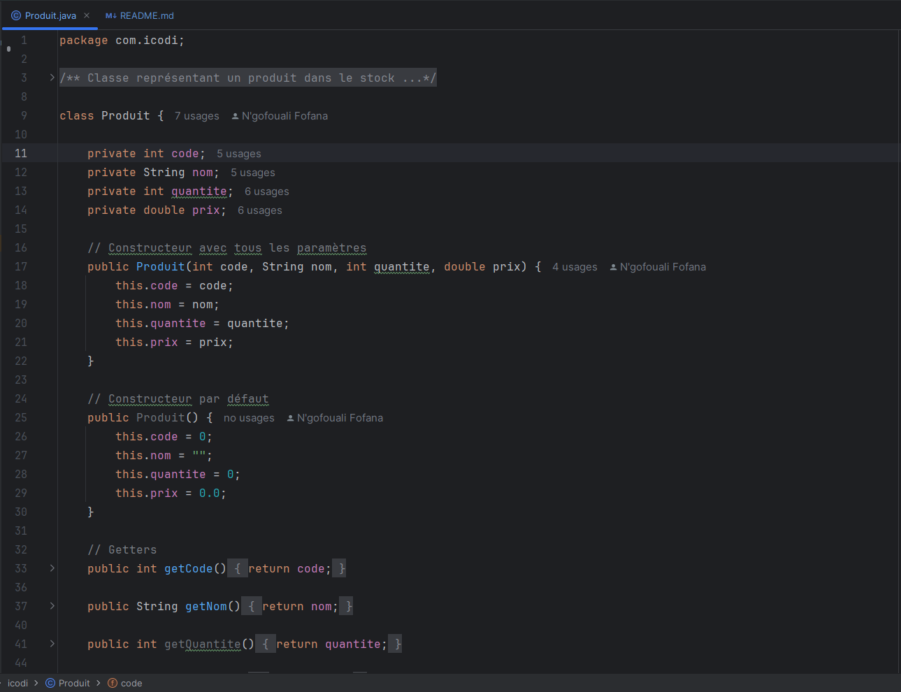
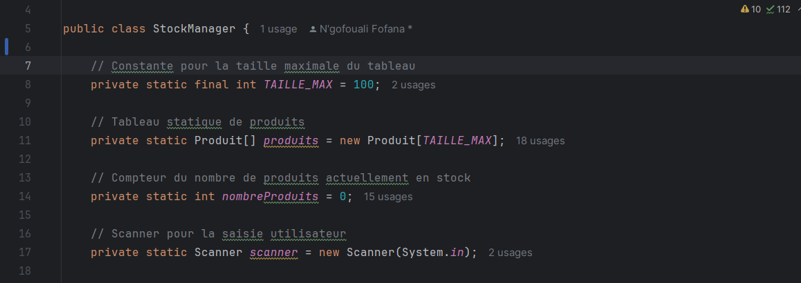
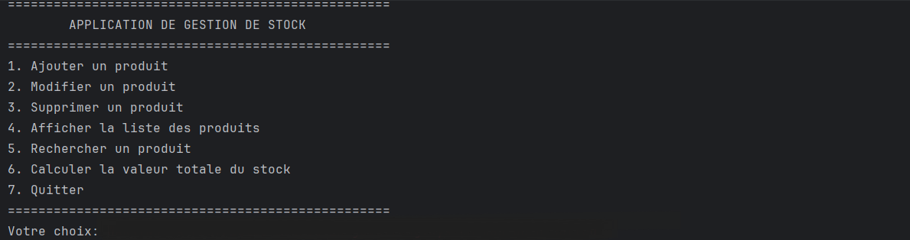
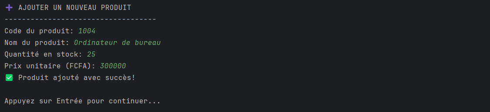
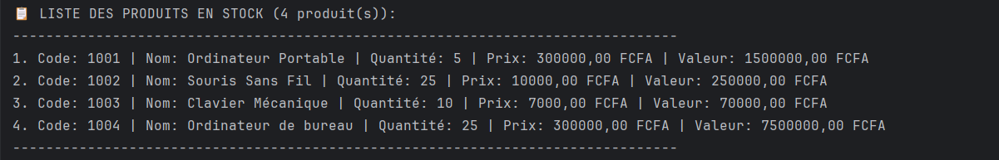

<h1>📦 Application Java de gestion des produits (POO)</h1>

<h3>Stock Manager est une application console Java utilisant les concepts de programmation orientée objet pour gérer l'inventaire d'une petite boutique.</h3>

 
<h2>🎯 Objectifs du Projet</h2>

<h3>Cette application a été développée dans le cadre d'un projet académique pour démontrer la maîtrise des concepts fondamentaux de la programmation orientée objet (POO) en Java, notamment :</h3>

<ul>
<li><strong>Encapsulation :</strong>Utilisation d'attributs privés et de méthodes d'accès contrôlé</li>
<li><strong>Abstraction :</strong>Séparation des responsabilités entre les classes</li>
<li><strong>Modularité :</strong>Code structuré et réutilisable</li>
<li><strong>Gestion de tableaux d'objets :</strong>Manipulation efficace de collections de données</li>
</ul>
 
<h2>✨ Fonctionnalités</h2>
<ul>
<li><strong>➕ Ajouter un produit - </strong> Création de nouveaux produits avec validation</li>
<li><strong>✏️ Modifier un produit - </strong> Mise à jour des informations existantes</li>
<li><strong>🗑️ Supprimer un produit - </strong> Suppression sécurisée avec réorganisation</li>
<li><strong>📋 Afficher la liste - </strong> Vue d'ensemble formatée de tous les produits</li>
</ul>
 
<h2>🔍 Recherche et Analyse</h2>
<ul>
<li><strong>➕ Ajouter un produit - </strong> Création de nouveaux produits avec validation</li>
<li><strong>✏️ Modifier un produit - </strong> Mise à jour des informations existantes</li>
<li><strong>🗑️ Supprimer un produit - </strong> Suppression sécurisée avec réorganisation</li>
<li><strong>📋 Afficher la liste - </strong> Vue d'ensemble formatée de tous les produits</li>
</ul>
 
<h2>🛡️ Sécurité et Validation</h2>
<ul>
<li>Codes produits uniques obligatoires</li>
<li>Validation des données (prix et quantités positifs)</li>
<li>Gestion des erreurs avec messages informatifs</li>
<li>Protection contre les débordements de tableau</li>
</ul>
 
<h2>🏗️ Architecture</h2>
<strong>Classe Produit</strong>
 

 
Caractéristiques :
<ul>
<li>Encapsulation complète avec getters/setters</li>
<li>Constructeurs (avec paramétres et par défaut)</li>
<li>Méthode calculerValeurTotale() pour la logique métier</li>
<li>Redéfinition de toString() pour un affichage optimisé</li>
</ul>
 
<strong>Classe StockManager</strong>

 
Fonctionnalités :
<ul>
<li>Gestion statique du tableau de produits</li>
<li>Méthodes CRUD (Create, Read, Update, Delete)</li>
<li>Interface utilisateur interactive avec menuValidation et gestion d'erreurs robustes</li>
</ul>
 
<h2>📱 Interface Utilisateur</h2>

 
<h2>Scénarios de Test</h2>
 

 

 

